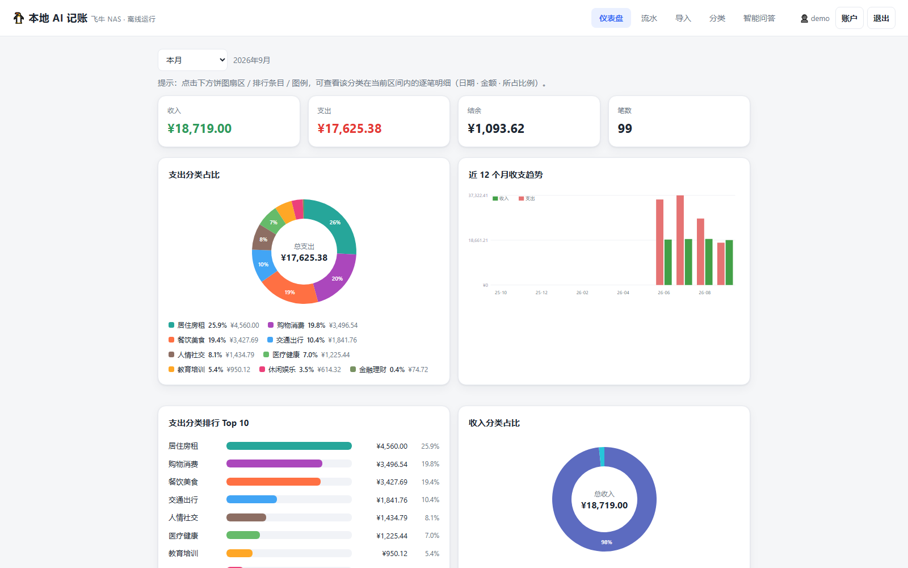
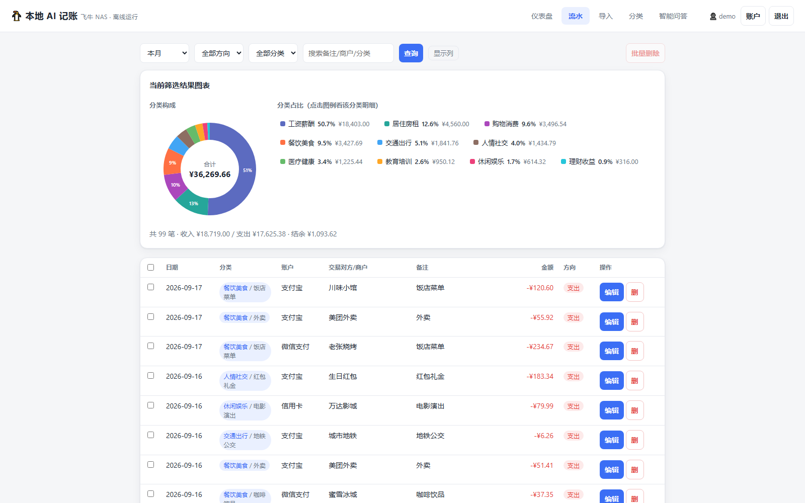
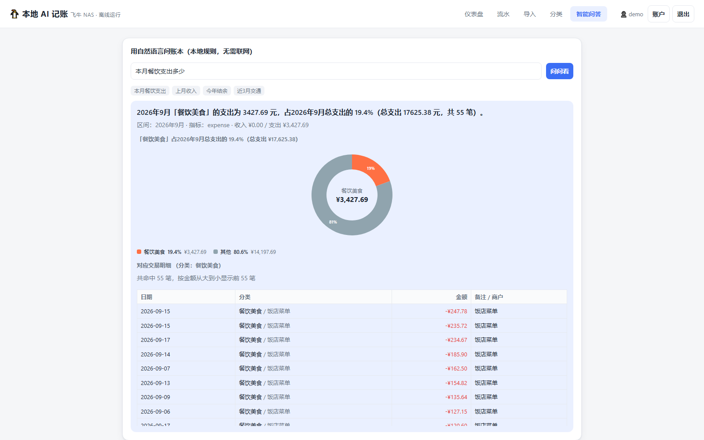
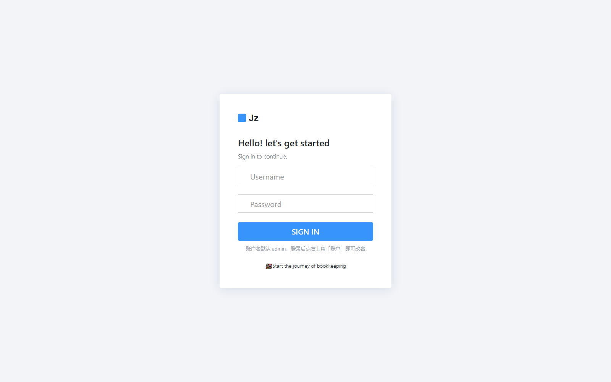

# 本地 AI 记账（飞牛 NAS 版）

一个**完全离线、零外部依赖**的本地记账系统，可部署在飞牛 NAS（FnOS）的 Docker 中。
支持导入随手记 / 钱迹 / 咔皮记账 / 挖财 等主流记账软件导出的 **Excel / CSV**，
并通过内置**本地规则引擎**自动分类、做统计与自然语言问答——不联网、不调用任何云 API，
数据只存在你自己的 NAS 上。

## 界面预览

> 以下截图均基于**纯虚构演示数据**生成，不含任何真实账目信息。
> 图片放在仓库的 `screenshots/` 目录里，用相对路径引用，克隆/离线也能正常显示。

**仪表盘** — 收支概览、支出分类占比、近 12 个月趋势、分类排行（点图例可下钻看逐笔）



**流水** — 时间段 / 方向 / 分类 / 关键字筛选，分类构成环形图 + 逐笔明细，每行可独立编辑、列宽可拖拽



**智能问答** — 用中文直接问，回答 + 占比环形图 + 命中明细，支持一级与二级分类



**登录** — 账户名 + 密码（PBKDF2 加盐哈希），会话 30 天



## 技术栈
- 后端：Python · FastAPI · SQLite（单文件，零配置）
- 解析：openpyxl（xlsx）/ csv（csv、txt、tsv）
- 前端：原生 HTML/JS/CSS，图表用本地 SVG 渲染（**无 CDN 依赖，断网也能用**）
- 部署：Docker + docker-compose，镜像约 150MB

## 快速开始（从 GitHub 克隆）

```bash
git clone <本仓库地址> ai-ledger
cd ai-ledger

# 准备访问密码（复制模板后改成你自己的强密码）
cp .env.example .env
# 编辑 .env，修改 LEDGER_PASSWORD

# 构建并启动（首次构建需几分钟，依赖已随 wheels/ 离线打包，无需联网）
docker compose up -d --build

# 浏览器打开 http://<机器IP>:8010
```

- 数据保存在本仓库的 `./data/ledger.db`（SQLite 单文件），**备份即复制该目录**。
- 首次启动用 `.env` 里的账户/密码登录；之后可在界面右上角「账户」里改密码。
- 本项目**不含任何个人账目数据**，`data/`、`.env` 均已被 `.gitignore` 排除。

## 目录结构
```
.
├── app/
│   ├── main.py          # FastAPI 入口与 REST API
│   ├── db.py            # SQLite 初始化
│   ├── categories.py    # 默认分类与关键词规则
│   ├── rules.py         # 规则引擎（关键词自动分类）
│   ├── importer.py      # Excel/CSV 读取 + 通用列映射
│   ├── stats.py         # 统计聚合 + 自然语言查询
│   └── static/          # 前端界面
├── Dockerfile
├── docker-compose.yml
├── requirements.txt
├── wheels/              # 离线依赖包（构建时不再联网，必须随项目一起上传）
├── screenshots/         # README 里引用的界面预览图（纯演示数据）
├── .env.example         # 密码模板（真实 .env 不进仓库）
├── .gitignore / .dockerignore
└── README.md
```

## 在飞牛 NAS 上部署

### 方式一：Docker 管理器（图形界面，推荐）
1. 飞牛 NAS 应用中心安装 **Docker**（容器管理）。
2. 把本项目整个文件夹（含 `Dockerfile`、`docker-compose.yml`、`app/`）拷贝到 NAS 任一目录，
   例如 `/vol1/1000/docker/ai-ledger`。
3. 打开 Docker 管理器 → ** compose 部署 / 项目 ** → 选择该目录 → 创建。
   镜像会自动构建（首次需几分钟），端口映射 `8000:8000`、数据卷 `./data:/data` 已写进 compose。
4. 浏览器访问 `http://<你的NAS内网IP>:8000` 即可使用。

### 方式二：SSH 终端
```bash
# 拷贝项目到 NAS 后进入目录
cd /vol1/1000/docker/ai-ledger
docker compose up -d --build
# 访问 http://<NAS_IP>:8000
```

### 常用命令
```bash
docker compose ps            # 查看状态
docker compose logs -f       # 查看日志
docker compose down          # 停止
docker compose up -d --build # 更新后重建
```

### 飞牛 NAS 实操提示
- **构建阶段需要联网**：首次「创建项目」会自动拉取 `python:3.11-slim` 基础镜像并 `pip install`，
  这一步 NAS 必须能访问 Docker Hub；镜像构建完成、容器跑起来后，整套应用**完全离线**，与之前联网无关。
  （ARM 版飞牛 / x86 版都支持，`python:3.11-slim` 是多架构镜像。）
- **数据在哪 / 怎么备份**：账目存在你选的项目目录下的 `data/ledger.db`（SQLite 单文件）。
  备份 = 直接把 `data` 文件夹拷走；换机迁移 = 连同 `data` 一起拷，无需重新配置。
- **端口冲突**：若 NAS 上 8000 已被占用，改 `docker-compose.yml` 左边端口即可，例如 `9000:8000`，
  然后访问 `http://<NAS_IP>:9000`。（注意：左边是宿主机端口，右边容器端口保持 8000 不要动。）
- **compose 项目放哪**：建议放带 Docker 的存储卷下，例如 `/vol1/1000/docker/ai-ledger`，
  用「文件管理」把整文件夹上传/拷过去，再在 Docker 管理器里「项目 → 创建项目」指向该目录。
- **远程访问（可选）**：需要外网访问时，优先用飞牛自带「远程访问 / 反向代理」或自建 VPN 暴露 8000。
  本系统已内置登录密码（见下文「登录密码」一节），但内网使用仍建议走飞牛自带通道，避免裸奔公网。

## 登录账户
系统内置简单登录鉴权（**账户名 + 密码** + 会话 Cookie，数据不外卖）：
- **默认账户名**：`admin`（对应 `docker-compose.yml` 里的 `LEDGER_USERNAME`）。
  **部署后建议改成你自己的名字**，登录后点右上角「账户」即可修改，界面改完不会被环境变量覆盖。
- **默认密码**：`docker-compose.yml` 里的环境变量 `LEDGER_PASSWORD=ledger123`。
  **部署后请务必改成你自己的密码**（首次启动会写入数据库，之后以数据库为准）。
- **改账户名 / 改密码**：登录后点右上角「账户」，在弹出的窗口里操作；两项都要先填当前密码。
  登录页上的「Change password?」也能直接打开这个窗口（无需先登录）。
- **忘了账户名**：看启动日志第一行 `[启动] 数据库=... 账户=...`，或访问 `/api/health` 的 `username` 字段。
- **退出登录**：右上角「退出」清空本地会话。
- **会话有效期**：30 天，过期需重新登录（登录状态靠 HttpOnly Cookie，与浏览器是否"记住我"无关）。
- **无密码模式**：若 `docker-compose.yml` 不设置 `LEDGER_PASSWORD` 且数据库里也没设过密码，
  系统自动回到「开放模式」（不拦截），方便在受信任的纯内网环境免密使用。
- 账户名以明文存于 `data/ledger.db`（它是身份标识，不是秘密）；
  密码以 PBKDF2-HMAC-SHA256 加盐哈希存储，明文不落盘。

> 详细的操作步骤、设计原理与排错方法见 [`docs/账户与登录改造说明.md`](docs/账户与登录改造说明.md)。

## 使用流程
1. 在手机记账 App 里「导出」为 Excel/CSV。
2. 打开本系统 → **导入** 页 → 上传文件。
3. 系统自动识别列名并给出建议映射；若不准，用下拉框手动指定
   「日期 / 金额 / 收支方向 / 分类(一级) / 子分类(二级) / 账户 / 交易对方 / 备注 / 计入收支」分别对应哪一列。
   - 来源可选「自动识别」或「咔皮记账」预设。
4. 点「确认导入」，数据按关键词规则自动归类。
   - 来源分类名会自动归一化到系统分类（如咔皮「餐饮 / 交通 / 购物」→「餐饮美食 / 交通出行 / 购物消费」）；
     无法对应的分类名会原样保留，不丢信息。
   - 「计入收支」为「否」的记录（转账 / 还款等）默认跳过，不污染收支统计。
5. 在 **仪表盘** 看收支概览与分类占比、趋势；在 **智能问答** 用中文问，例如：
   `本月餐饮支出多少`、`上个月收入多少`、`今年结余`、`最近3个月交通花了多少`。

## 数据说明
- 账目数据保存在 `./data/ledger.db`（SQLite 单文件）。**备份 = 直接拷贝 `data` 目录**。
- 想迁移到新 NAS：拷走整个项目文件夹（含 data）即可，无需重新配置。
- 分类与关键词规则可在 **分类** 页增删，导入和问答都会据此自动归类。

## 自定义分类规则
编辑 `app/categories.py` 的 `DEFAULT_CATEGORIES`（仅在分类表为空时生效），
或通过界面「分类」页动态增删。关键词命中优先级：先按已有分类名 → 再按关键词。
收入类分类命中时方向记为「收入」，支出类记为「支出」。

## 导入预设

导入页提供 4 个预设按钮，点一下即可自动把列映射好；用「自动识别」也能识别常见表头。

| 预设 | 适用导出文件 | 关键列 |
|---|---|---|
| 微信账单 | 微信支付账单（xlsx / csv） | 交易时间 / 收-支 / 金额(元) / 交易对方 / 商品 / 支付方式 |
| 支付宝账单 | 支付宝账单（csv） | 交易时间 / 收-支 / 金额 / 交易对方 / 商品说明 / 收-付款方式 |
| 咔皮记账 | 咔皮记账（xlsx） | 日期 / 类型 / 金额 / 一级分类 / 二级分类 / 账户 / 计入收支 |
| 银行流水 | 银行导出的流水（通用兜底） | 交易日期 / 交易金额 / 交易对手 / 摘要 |

**跳过规则**：以下行不会计入收支统计，但会在结果里报告跳过原因，不会静默丢失——
- 「计入收支」列为「否」（转账、还款、报销等）；
- 「收/支」列为 `/`、`不计入收支` 等中性标记（微信/支付宝的转账、提现、还款）。

## 关于「咔皮记账」预设
已按咔皮记账**真实导出列**校准（共 13 列）：

| 咔皮导出列 | 映射到 |
|---|---|
| 日期 | 日期 |
| 时间 | （保留在原始数据中） |
| 类型 | 收支方向（收入/支出） |
| 金额 | 金额 |
| 一级分类 | 分类 |
| 二级分类 | 子分类 |
| 账户 | 账户 |
| 备注 | 备注（咔皮无独立商户列，商户信息通常写在备注里） |
| 计入收支 | 计入收支（为「否」时跳过该行） |
| 标签 / 计入预算 / 所属账本 / 分摊明细 | 保留在原始数据中 |

一级分类会自动归一化到系统分类（如「餐饮」→「餐饮美食」），二级分类原样保留。
若你的导出列名与上述不同，导入时用「自动识别」+ 手动映射即可。

## 拉取基础镜像失败（飞牛 NAS 镜像源）

构建时若出现以下报错，**与代码无关，是 NAS 拉不到基础镜像 `python:3.11-slim`**：

```
failed to solve: python:3.11-slim: ... 401 Unauthorized
Get "https://registry-1.docker.io/v2/": context deadline exceeded
```

原因：飞牛默认把 `docker.io` 请求转给自家代理 `docker.fnnas.com`，该代理对官方镜像返回 401，
且 NAS 直连 Docker Hub 超时。按下面顺序解决（推荐 ① → ② → ③）。

**① 确认飞牛账号已登录**
`docker.fnnas.com` 返回 401 常因 FnOS 未登录飞牛云。进入 **设置 → 账户**，登录飞牛账号后重试构建。

**② 配置公共镜像加速器（图形界面，推荐）**
Docker 管理器 → **设置 → 仓库 / 镜像加速**，填入以下任一地址并「应用 / 保存」：

- `https://hub-mirror.c.163.com`（网易，通常免登录）
- `https://docker.m.daocloud.io`
- `https://docker.xuanyuan.me`
- `https://dockerhub.icu`

然后删除原 `ai-ledger` 项目并重新「创建项目」，或 SSH 执行 `docker compose up -d --build`。

**③ SSH 改 daemon 并重启（仍不行时）**
```bash
cat > /etc/docker/daemon.json <<'EOF'
{ "registry-mirrors": ["https://hub-mirror.c.163.com"] }
EOF
# 重启 Docker：下面命令或 Docker 设置页点「重启」
systemctl restart docker
cd /vol1/1000/docker/ai-ledger   # 换成你上传的项目目录
docker compose up -d --build
```

**验证镜像源是否生效**（SSH 里执行，能拉下来即可 build 本项目）：
```bash
docker pull python:3.11-slim
# 出现 Status: Downloaded ... 即说明源 OK
```

**④ 改用非 docker.io 的镜像源（绕过飞牛劫持，推荐优先试）**

飞牛只劫持 `docker.io` 这个域名。把基础镜像换成**第三方代理域名**即可绕过 401。
本仓库 `docker-compose.yml` 已默认用第三方源，你只需把它换成**在 NAS 上能通**的那个即可。

> **步骤（全程不用 SSH、不用下软件）**：
> 1. 在你电脑的「记事本」里粘贴下面这段，**把 `dockerpull.com` 换成下方「备选源」里能用的那个**：
> ```yaml
> services:
>   ledger:
>     build:
>       context: .
>       args:
>         PY_BASE: dockerpull.com/library/python:3.11-slim    # ← 换成能用的源
>     image: ai-ledger:latest
>     container_name: ai-ledger
>     ports: ["8000:8000"]
>     volumes: ["./data:/data"]
>     environment:
>       - LEDGER_DB=/data/ledger.db
>       - PORT=8000
>       - LEDGER_PASSWORD=ledger123
>     restart: unless-stopped
> ```
> 2. 记事本「文件 → 另存为」：`"docker-compose.yml"`、保存类型**所有文件**、编码 **UTF-8**，存桌面。
> 3. 飞牛「文件管理」→ 项目目录 → 上传**覆盖**旧的 `docker-compose.yml`。
> 4. Docker 管理器 → 删除 `ai-ledger` 项目 → 重新「创建项目」(选目录) → 重建。

备选源（按此顺序逐个试，哪个在 NAS 上能拉到 `python:3.11-slim` 就用哪个；★ 用户实测 `docker.1panel.live` 在飞牛 NAS 上可拉镜像）：
1. `dockerpull.com/library/python:3.11-slim`
2. `dockerhub.icu/library/python:3.11-slim`
3. `cghub.cn/library/python:3.11-slim`
4. `image.cloudlayer.icu/library/python:3.11-slim`
5. `hub.rat.dev/library/python:3.11-slim`
6. `docker.1panel.dev/library/python:3.11-slim`
7. `dhub.kubesre.xyz/library/python:3.11-slim`
8. 阿里云 ACR 专属加速：登录阿里云容器镜像服务，获取 `<你的id>.mirror.aliyuncs.com/library/python:3.11-slim`
> 第三方代拉域名会随时失效；若上面 1-7 都连不通，优先试第 ⑧ 阿里云（最稳），或走下方「离线导入」。
> 另外：若你已在飞牛 Docker 设置里配置过「镜像加速」(registry-mirror) 且该设置对所有镜像生效，
> 也可删掉 compose 里 `build.args` 那两行，直接用官方 `python:3.11-slim`（由飞牛转给你的镜像加速拉取）。

> 注意：飞牛部分版本会强制走 `fnnas` 代理，`registry-mirrors` 可能被覆盖。若①②③④都不行，
> 走「离线导入」——在另一台能联网的电脑 `docker build` 后 `docker save` 成 tar，拷到 NAS `docker load`
> 即可，彻底绕开 NAS 拉镜像的网络问题。

## 常见问题
- **拉不到基础镜像**：见上一节「拉取基础镜像失败（飞牛 NAS 镜像源）」，先配镜像源或登录飞牛账号。
- **`pip install ... exit code 1`**：容器内 pip 连不上包源（飞牛 NAS 容器常连不上 `pypi.org` / 清华源）。
  本仓库已改为**离线安装**：全部依赖的 wheel 打包在 `wheels/` 目录，Dockerfile 用 `--no-index --find-links` 本地安装，构建时**完全不联网**。
  所以 `wheels/` 必须随项目一起上传到 NAS；若构建日志出现 `ERROR: /app/wheels 为空或不存在！`，就是漏传了这个目录。
- **导入报错 `Unexpected token 'I', "Internal S"... is not valid JSON`**：这是**旧版本**的 bug——
  后端导入接口遇到异常时返回了纯文本 `Internal Server Error`，前端按 JSON 解析失败，于是真正的错误信息被吞掉了。
  现已修复：① 后端任何异常都会返回 JSON 并附带真实原因；② 导入接口全程捕获异常；
  ③ 修复了 xlsx 日期列（datetime 对象）序列化导致的崩溃。
  **请更新 `app/` 目录后重新构建镜像。**
- **导入页显示「共 0 行」/「成功导入 0 笔」**：
  1. 若是**共 0 行**（一个数据行都没解析出来）——常见于咔皮记账等 App 导出的 xlsx：文件里工作表带着
     错误的尺寸声明 `<dimension ref="A1">`（即自称「只有一个单元格」），openpyxl 的只读模式会相信它，
     把整张 819 行的表读成 1 行 1 列。**已修复**：读取时先 `reset_dimensions()` 忽略该声明，
     并在多张工作表中自动选「数据行最多」的那张（自动跳过咔皮的「内部转账」等辅助表）。
  2. 若是解析出了行数但导入 0 笔——说明日期列没识别对。点一下对应来源的预设按钮
     （如「微信账单」/「咔皮记账」），或在映射表里手动把「日期」指向真正的日期列；
     结果行会列出每类跳过原因，照着排查即可。
  以上 1、2 两处都需要**更新 `app/` 目录后重新构建镜像**才生效。
- **仪表盘选「全部」时页面报错 / 显示 500**：旧版在筛选条件为空时会拼出非法 SQL
  （`FROM transactions AND direction='income'`）。已修复为统一构造 WHERE 子句。同样需更新 `app/` 后重建。
- **导入报错「未找到有效数据行」**：确认文件是 xlsx/csv 且首行是表头；旧版 `.xls` 请先「另存为 .xlsx」。
- **金额符号不对**：本系统统一以「支出为负、收入为正」存储；若原表方向列写反，可在映射里正确指定「收支方向」列。
- **想换端口**：修改 `docker-compose.yml` 的 `8000:8000` 前半部分（如 `9000:8000`）。
- **完全离线**：前端不引用任何外部资源，NAS 不联网也能正常打开与使用。
